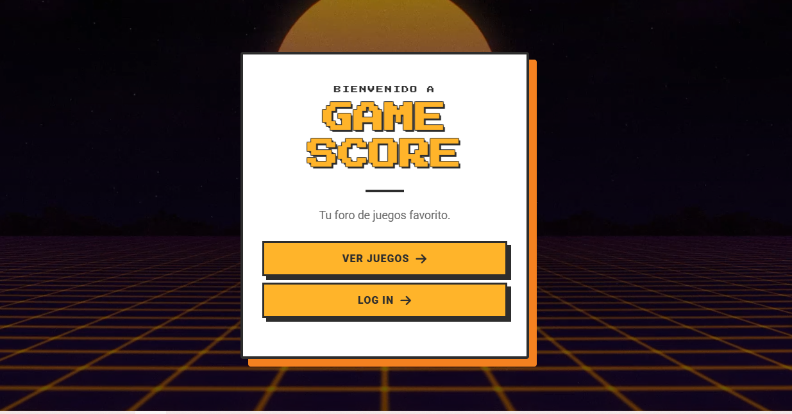
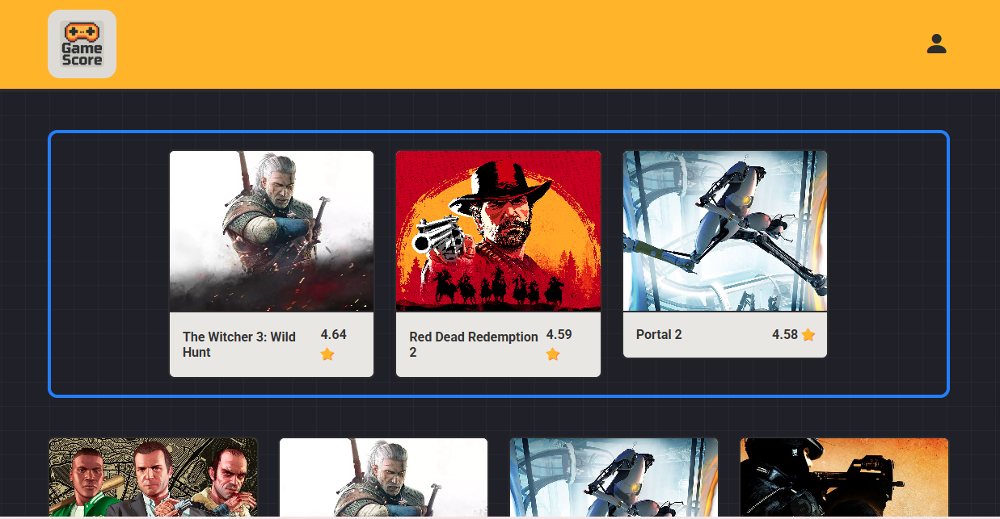
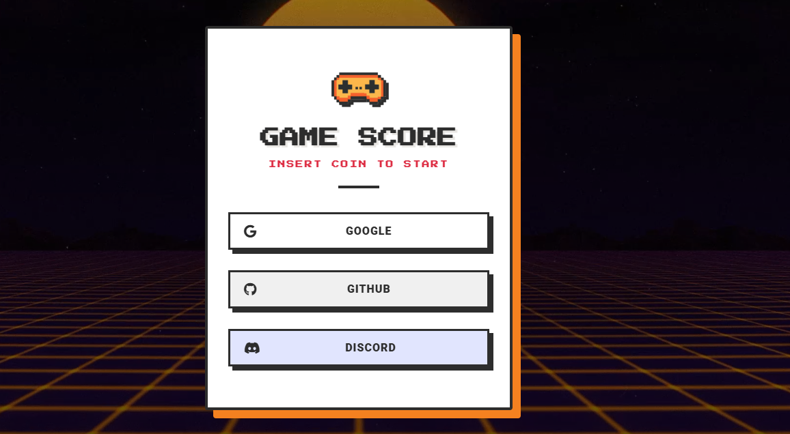
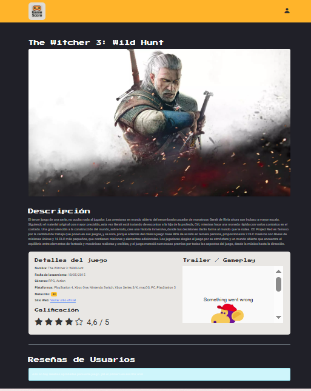
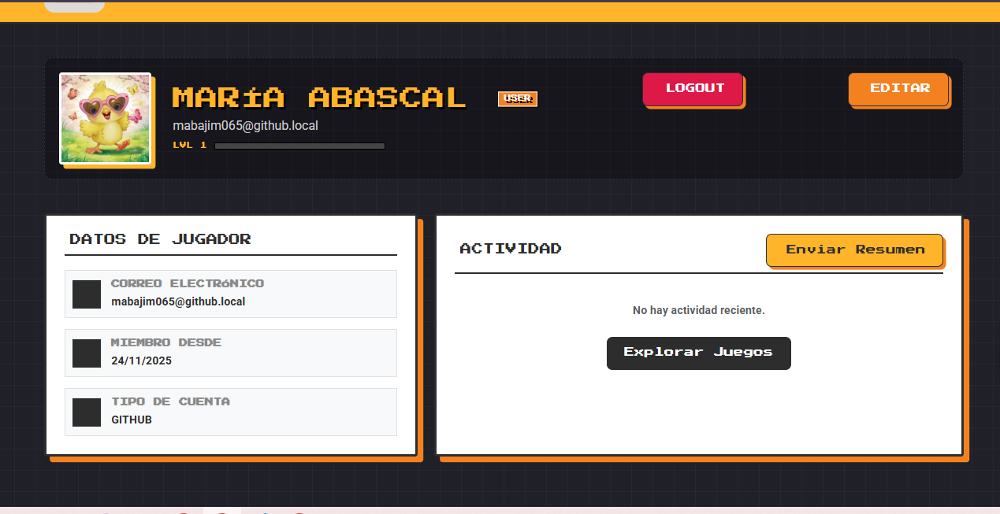

# GameScore

## **1. Descripción del Proyecto y Temática Elegida**

**GameZone** es una plataforma web moderna diseñada para entusiastas de los videojuegos. El objetivo principal del proyecto es ofrecer un catálogo centralizado de juegos, donde los usuarios pueden no solo consultar información detallada, sino también participar activamente creando reseñas, llevando un registro de sus logros personales y descubriendo nuevos títulos.

## **2. Lista de funcionalidades implementadas**
El proyecto se divide en tres módulos funcionales principales:
    I. Módulo Público y Catálogo (Acceso Abierto)
        - Página de Inicio (index.html): Portal de bienvenida con enlaces de acceso y un diseño retro.

        -Catálogo de Juegos (games.html): Listado navegable de videojuegos, incluyendo títulos destacados.

        -Detalle del Juego (game-detail.html): Información completa de un título y sección de reseñas publicadas.

        -Información Corporativa: Vistas de apoyo como Sobre-Nosotros.html y Politica-Privacidad.html.

    II. Módulo de Usuario (Rol: USER)
        -Registro y Login (register.html, login.html): Soporte para registro tradicional y autenticación social (SSO) vía OAuth 2.0.

        -Perfil Personal (profile.html): Visualización de datos, actividad, reseñas recientes y juegos favoritos.

        -Edición de Perfil (edit-profile.html): Permite al usuario actualizar su nombre, username y URL de avatar (con previsualización).

        -Formulario de Reseña (review-form.html): Crear o editar una reseña con título, contenido y puntuación de 1 a 5 estrellas.

        - Envío de Resumen de Actividad: Funcionalidad para que el usuario solicite el envío de un email con un resumen de sus estadísticas (summary-template.html).

    III. Módulo de Administración (Rol: ADMIN)
        Este módulo solo es accesible para usuarios con el rol ADMIN.

        -Panel Principal (dashboard.html): Vista de estadísticas clave (usuarios totales, nuevos, bajas, métricas de juegos y reseñas) con gráficos de seguimiento (Chart.js).

        -Gestión de Juegos (games.html):
            -Listado y búsqueda de juegos con detalles básicos.
            -Botón para Reestablecer Videojuegos (sincronización con API externa).
            -Formulario de Juego (game-form.html): Creación y edición de juegos, permitiendo modificar datos detallados como slug, rating, metacritic y URL de imágenes.

        -Gestión de Reseñas (reviews.html):
            -Listado completo de todas las reseñas de la plataforma.
            -Filtros Avanzados: Filtrado por estado (PENDING, APPROVED, REJECTED) y puntuación mínima.
            -Acciones de Moderación: Permite al administrador aprobar o rechazar las reseñas.
        -Gestión de Usuarios (users.html):
            -Listado y búsqueda de usuarios por nombre, username o email.
            - Edición de Roles: Permite modificar el rol del usuario (por ejemplo, ascender o descender a ADMIN).
            - Eliminación Segura: Funcionalidad para eliminar usuarios con modal de confirmación (Bootstrap Modal).

## **3.APIs utilizadas y justificación de su elección**
1. RAWG Video Games Database API (Base de Datos de Contenido)
Esta es la API principal para la ingesta de datos de videojuegos. Se utiliza para nutrir el catálogo de GameScore con información detallada, metadatos, calificaciones (rating, Metacritic) y recursos gráficos de alta calidad (backgroundUrl).

Justificación:
- Riqueza y Cobertura: RAWG ofrece uno de los catálogos de videojuegos más extensos y actualizados del mercado, lo cual es fundamental para mantener la relevancia del foro.
- Eficiencia: Permite que la plataforma obtenga datos cruciales (descripciones, géneros, calificaciones externas) sin requerir un mantenimiento manual intensivo por parte del equipo de administración.
- Experiencia Visual: Proporciona las URLs de imágenes de fondo y banners necesarias para una experiencia de usuario inmersiva y profesional.

2. Google, GitHub, y Discord (APIs de Autenticación OAuth 2.0)

Estas integraciones de OAuth 2.0 gestionan el acceso de los usuarios a la plataforma (inicio de sesión y registro social).

Justificación:
- Mejora de la UX: Permite un proceso de registro e inicio de sesión rápido (Single Sign-On), eliminando la fricción de tener que crear y recordar nuevas credenciales.
- Seguridad Delegada: Transfiere la responsabilidad de la gestión de contraseñas y la autenticación a proveedores de identidad líderes en la industria, aumentando la confianza del usuario en la seguridad de la plataforma.
- Relevancia de la Audiencia: GitHub y Discord son plataformas que resuenan fuertemente con la comunidad gamer y de desarrolladores, alineándose con el público objetivo de GameScore.

3. Servicio de Correo Electrónico (Comunicación)
Justificación:
- Una plataforma social y de seguimiento necesita una vía fiable para la comunicación asíncrona y la gestión de la actividad del usuario.
- Necesidad: Enviar notificaciones críticas, como el resumen de actividad solicitado por el usuario o futuros mensajes de restablecimiento de contraseña (aunque el SSO lo mitiga).
- Motivo del Servicio SMTP/Spring Mailer: Permite a la aplicación (el backend de Spring Boot) actuar como remitente. La funcionalidad de "Enviar Resumen" (visto en la página /perfil) es un ejemplo directo de esto, permitiendo a los usuarios llevar un registro externo de sus actividades y juegos favoritos. Un servicio de email externo es necesario porque la aplicación web no puede enviar correos directamente sin un servidor de correo configurado.

## **4. Instrucciones de instalación y configuración**
Una vez tiene Compartido el repositorio, lo vamos a clonar desde github desktop , pinchar en "add" , a continuación darle a " clone repository", clonamos el repositorio que en nuestro caso es GameStory, y a continuación vamos a ejecutar el BackApplication.java .
a continuación nos iremos a nuestro navegador y pondremos https:localhost/8080/juegos .

## **5. Credenciales de prueba para cada rol**
admin@gamescore.com = admin123
user1@test.com = user123

## **6. Capturas de pantalla de todas las vistas principales**

